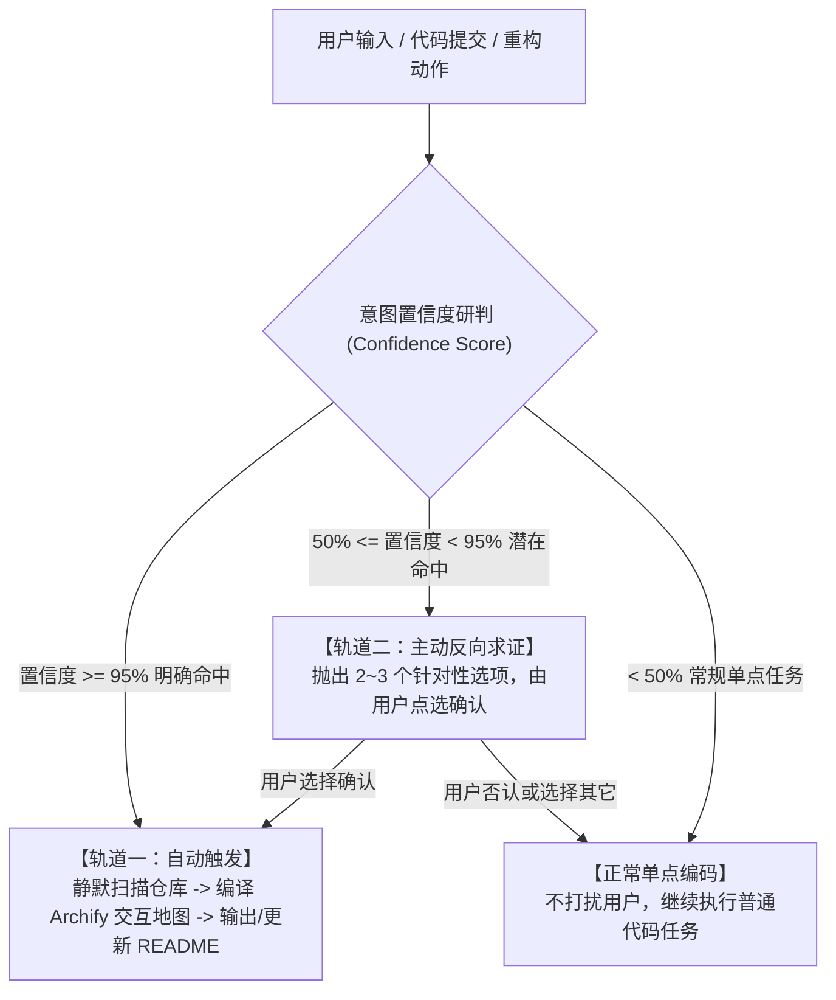

# Archify 交互式系统地图智能感知与工程规范 (Autonomous Archify Engineering Protocol)

本 Skill 具备 **前置意图感知（Autonomous Intent Sensing）**、**95% 置信度双轨自决策** 与 **纯正 SVG 矢量拓扑+全链路三色探针标准**。

---

## 一、 核心渲染与交互硬性防御铁律 (Anti-Bug & Quality Shield)

在生成任何 `.html` 架构地图时，Agent **必须严格遵守以下两条防御铁律，严禁出现任何缩水与降级**：

### 1. 绝对禁止降级为普通网页卡片 (Pure SVG Vector Mandate)
- ❌ **绝对禁止**：使用普通 HTML `div` / CSS flex / grid 网格卡片排列。
- ✅ **必须强制**：
  1. 使用标准 `<svg viewBox="0 0 1200 780">` 绝对坐标拓扑画布；
  2. 必须绘制**正交矢量连线（`<path class="flow-line">`）**，配合箭头标头（`marker-end="url(#arrowhead)"`）；
  3. 连线上必须携带**带框路径标签（Flow Badge）**（如 `消息`、`2.5s聚合`、`0ms存草稿`、`返回 sp_no`）；
  4. 注入 `Signal Flow` / `Blueprint` 专属霓虹发光滤镜（Neon Glow）与 `JetBrains Mono` 字体。

### 2. 节点探针三色联动与防孤立暗化协议 (Tri-Color Linkage Protocol)
- ❌ **绝对禁止**：点击某个节点时，只亮它自己而把所有上下游节点与连线全部暗化。
- ✅ **必须强制**：当用户点击任意节点时，必须触发**三色全链路高亮联动**：
  1. 🟡 **目标节点（Target）**：以粗金色霓虹边框（`#fbbf24`）和高亮背景呈现；
  2. 🟢 **所有直接上游节点（Upstream）**：以翠绿色边框（`#10b981`）联动点亮；
  3. 🔵 **所有直接下游节点（Downstream）**：以天蓝色边框（`#38bdf8`）联动点亮；
  4. ⚡ **关联的正交连接线（Flow Lines）**：自动切换为 `active-flow` 并开启流动虚线动画（`flowDash`）；
  5. 🔲 **完全无关的节点**：才被柔和暗化（`opacity: 0.18`）；
  6. 📋 **浮动探测面板（Inspector）**：右下角必须弹出 Inspector 详情，并提供可直接点击跳转的上下游胶囊标签。

---

## 二、 语言与本地化铁律 (100% 中文本地化保障)

**核心原则：除非用户显式要求纯英文，否则 Agent 生成的所有系统地图内容必须 100% 采用地道、专业的中文（或中英双语对照）。**

1. **大标题与副标题**：全部使用中文（如：`企业微信出差报销智能 Agent · 系统运行时全景地图`）。
2. **区域分层（Sections / Layers）**：使用标准中文架构术语（如：`01 / 客户端与长连接接入层`、`02 / 接入网关与安全防护层`、`03 / 核心 Agent 调度与双轨引擎`、`04 / 状态存储与官方审批出口`）。
3. **节点名称与操作副标题**：使用清晰中文（如：`📱 企微员工客户端`、`🧭 出差槽位状态机 (A轨)`、`⚖️ 财务合规校验器`）。
4. **动态演示故事章节（Guided Views）**：必须使用中文撰写完整业务流（如：`01 出差申请极速直出流 (0ms)`、`02 多票据解包与多模态核验`、`03 官方审批提单与素材上传`），并提供分步面包屑导航。

---

## 三、 95% 置信度双轨自决策机制

Agent 在日常对话和代码操作中，时刻执行以下决策流水线：

### 场景研判规则库 (四大场景)
1. **项目全景摸底**：明确时（>=95%）直接输出全景 SVG 地图；模糊时主动出题询问是否需要生成全景地图。
2. **完工提交与自述文档美化**：明确时（>=95%）自动生成架构图、导出 1200×630 分享卡片写入 `README.md` 并提交；模糊时主动确认。
3. **核心模块重构与影响面分析**：修改关键公共模块时，主动询问或自动启动 `Reach Tracing` 影响面分析。
4. **跨服务复杂链路演示**：涉及多服务调用流时，主动生成带 `Guided Views` 的分步时序地图。

---

## 四、 标准交付检查清单 (Delivery Checklist)

每次交付 Archify HTML 产物前，必须进行三项前置自检：
- [ ] **是否为纯 SVG 矢量图谱**（包含 `<svg viewBox>`、`<path>` 正交箭头、泳道分组、霓虹滤镜）？
- [ ] **是否已具备三色联动探针**（金色目标 + 绿色上游 + 蓝色下游 + 动态流动虚线）？
- [ ] **语言是否为 100% 中文**（大标题、分层、节点、说明、Guided Views 全部中文化）？
